<!--
 * @Author: Conghao Wong
 * @Date: 2021-04-16 09:07:48
 * @LastEditors: Conghao Wong
 * @LastEditTime: 2021-07-16 16:53:48
 * @Description: file content
-->

# Classes Used in This Project

Packages:

```python
import modules.models.base as base
import modules.models.prediction as prediction

import tensorflow as tf
from tensorflow import keras
```

```mermaid
    graph LR
        builtins_object("object(builtins)") --> modules.vertical.__utils_Utils("Utils(modules.vertical.__utils)")
        tqdm.utils_Comparable("Comparable(tqdm.utils)") --> tqdm.std_tqdm("tqdm(tqdm.std)")
        builtins_object("object(builtins)") --> builtins_type("type(builtins)")
        modules.models.base.__agent_Agent("Agent(modules.models.base.__agent)") --> modules.models.prediction.__agent_PredictionAgent("PredictionAgent(modules.models.prediction.__agent)")
        builtins_object("object(builtins)") --> modules.models.base.__visualization_Visualization("Visualization(modules.models.base.__visualization)")
        modules.models.base.__baseObject_BaseObject("BaseObject(modules.models.base.__baseObject)") --> modules.models.base.__structure_Structure("Structure(modules.models.base.__structure)")
        argparse__AttributeHolder("_AttributeHolder(argparse)") --> argparse_Namespace("Namespace(argparse)")
        keras.engine.training_Model("Model(keras.engine.training)") --> modules.models.base.__structure_Model("Model(modules.models.base.__structure)")
        builtins_object("object(builtins)") --> modules.models.base.__baseObject_BaseObject("BaseObject(modules.models.base.__baseObject)")
        modules.models.base.__args.base_BaseArgs("BaseArgs(modules.models.base.__args.base)") --> modules.models.base.__args.args_BaseTrainArgs("BaseTrainArgs(modules.models.base.__args.args)")
        builtins_object("object(builtins)") --> modules.models.base.__args.base_BaseArgs("BaseArgs(modules.models.base.__args.base)")
        modules.models.base.__baseObject_BaseObject("BaseObject(modules.models.base.__baseObject)") --> modules.models.base.__agent_Agent("Agent(modules.models.base.__agent)")
        modules.models.base.__baseObject_BaseObject("BaseObject(modules.models.base.__baseObject)") --> modules.models.base.__dataset.datasetManager_DatasetsManager("DatasetsManager(modules.models.base.__dataset.datasetManager)")
        modules.models.base.__baseObject_BaseObject("BaseObject(modules.models.base.__baseObject)") --> modules.models.base.__dataset.datasetManager_DatasetManager("DatasetManager(modules.models.base.__dataset.datasetManager)")
        builtins_object("object(builtins)") --> modules.models.base.__dataset.dataset_DatasetsInfo("DatasetsInfo(modules.models.base.__dataset.dataset)")
        builtins_object("object(builtins)") --> modules.models.base.__dataset.dataset_Dataset("Dataset(modules.models.base.__dataset.dataset)")
        builtins_FileNotFoundError("FileNotFoundError(builtins)") --> modules.models.prediction.dataset._trainManager_TrajMapNotFoundError("TrajMapNotFoundError(modules.models.prediction.dataset._trainManager)")
        modules.models.base.__args.args_BaseTrainArgs("BaseTrainArgs(modules.models.base.__args.args)") --> modules.models.prediction.__args_PredictionArgs("PredictionArgs(modules.models.prediction.__args)")
        modules.models.base.__baseObject_BaseObject("BaseObject(modules.models.base.__baseObject)") --> modules.models.prediction.__maps_MapManager("MapManager(modules.models.prediction.__maps)")
        builtins_object("object(builtins)") --> modules.models.prediction.__traj_EntireTrajectory("EntireTrajectory(modules.models.prediction.__traj)")
        modules.models.base.__dataset.datasetManager_DatasetsManager("DatasetsManager(modules.models.base.__dataset.datasetManager)") --> modules.models.prediction.dataset._trainManager_DatasetsManager("DatasetsManager(modules.models.prediction.dataset._trainManager)")
        modules.models.base.__dataset.datasetManager_DatasetManager("DatasetManager(modules.models.base.__dataset.datasetManager)") --> modules.models.prediction.dataset._trainManager_DatasetManager("DatasetManager(modules.models.prediction.dataset._trainManager)")
        modules.models.base.__visualization_Visualization("Visualization(modules.models.base.__visualization)") --> modules.models.prediction.__vis_TrajVisualization("TrajVisualization(modules.models.prediction.__vis)")
        modules.models.base.__structure_Structure("Structure(modules.models.base.__structure)") --> modules.models.prediction.__structure_Structure("Structure(modules.models.prediction.__structure)")
        modules.models.base.__structure_Model("Model(modules.models.base.__structure)") --> modules.models.prediction.__structure_Model("Model(modules.models.prediction.__structure)")
        builtins_object("object(builtins)") --> modules.models.helpmethods.__helpmethods_BatchIndex("BatchIndex(modules.models.helpmethods.__helpmethods)")
        keras.engine.base_layer_Layer("Layer(keras.engine.base_layer)") --> modules.vertical.__layers_TrajEncoding("TrajEncoding(modules.vertical.__layers)")
        keras.engine.base_layer_Layer("Layer(keras.engine.base_layer)") --> modules.vertical.__layers_IFFTlayer("IFFTlayer(modules.vertical.__layers)")
        keras.engine.base_layer_Layer("Layer(keras.engine.base_layer)") --> modules.vertical.__layers_GraphConv("GraphConv(modules.vertical.__layers)")
        keras.engine.base_layer_Layer("Layer(keras.engine.base_layer)") --> modules.vertical.__layers_FFTlayer("FFTlayer(modules.vertical.__layers)")
        keras.engine.base_layer_Layer("Layer(keras.engine.base_layer)") --> modules.vertical.__layers_ContextEncoding("ContextEncoding(modules.vertical.__layers)")
        modules.models.prediction.__args_PredictionArgs("PredictionArgs(modules.models.prediction.__args)") --> modules.vertical.__args_VArgs("VArgs(modules.vertical.__args)")
        modules.vertical.__Viris_VIris("VIris(modules.vertical.__Viris)") --> modules.vertical.__VirisG_VIrisG("VIrisG(modules.vertical.__VirisG)")
        modules.models.prediction.__structure_Structure("Structure(modules.models.prediction.__structure)") --> modules.vertical.__VirisBeta_VIrisBeta("VIrisBeta(modules.vertical.__VirisBeta)")
        modules.models.prediction.__structure_Model("Model(modules.models.prediction.__structure)") --> modules.vertical.__VirisBeta_VIrisBetaModel("VIrisBetaModel(modules.vertical.__VirisBeta)")
        modules.models.prediction.__structure_Model("Model(modules.models.prediction.__structure)") --> modules.vertical.__VirisAlphaG_VIrisAlphaGModel("VIrisAlphaGModel(modules.vertical.__VirisAlphaG)")
        modules.vertical.__VirisAlpha_VIrisAlpha("VIrisAlpha(modules.vertical.__VirisAlpha)") --> modules.vertical.__Viris_VIris("VIris(modules.vertical.__Viris)")
        keras.engine.base_layer_Layer("Layer(keras.engine.base_layer)") --> modules.applications.layers.__traj_TrajEncoding("TrajEncoding(modules.applications.layers.__traj)")
        keras.engine.base_layer_Layer("Layer(keras.engine.base_layer)") --> modules.applications.layers.__fftlayers_FFTlayer("FFTlayer(modules.applications.layers.__fftlayers)")
        keras.engine.base_layer_Layer("Layer(keras.engine.base_layer)") --> modules.applications.layers.__traj_ContextEncoding("ContextEncoding(modules.applications.layers.__traj)")
        keras.engine.base_layer_Layer("Layer(keras.engine.base_layer)") --> modules.applications.layers.__linear_LinearLayer("LinearLayer(modules.applications.layers.__linear)")
        keras.engine.base_layer_Layer("Layer(keras.engine.base_layer)") --> modules.applications.layers.__linear_LinearInterpolation("LinearInterpolation(modules.applications.layers.__linear)")
        keras.engine.base_layer_Layer("Layer(keras.engine.base_layer)") --> modules.applications.layers.__graphConv_GraphConv("GraphConv(modules.applications.layers.__graphConv)")
        keras.engine.base_layer_Layer("Layer(keras.engine.base_layer)") --> modules.applications.layers.__fftlayers_IFFTlayer("IFFTlayer(modules.applications.layers.__fftlayers)")
        keras.engine.base_layer_Layer("Layer(keras.engine.base_layer)") --> modules.applications.__transformer._utils_MultiHeadAttention("MultiHeadAttention(modules.applications.__transformer._utils)")
        keras.engine.training_Model("Model(keras.engine.training)") --> modules.applications.__transformer._transformer_TransformerEncoder("TransformerEncoder(modules.applications.__transformer._transformer)")
        keras.engine.training_Model("Model(keras.engine.training)") --> modules.applications.__transformer._transformer_Transformer("Transformer(modules.applications.__transformer._transformer)")
        keras.engine.base_layer_Layer("Layer(keras.engine.base_layer)") --> modules.applications.__transformer._transformer_EncoderLayer("EncoderLayer(modules.applications.__transformer._transformer)")
        keras.engine.base_layer_Layer("Layer(keras.engine.base_layer)") --> modules.applications.__transformer._transformer_Encoder("Encoder(modules.applications.__transformer._transformer)")
        keras.engine.base_layer_Layer("Layer(keras.engine.base_layer)") --> modules.applications.__transformer._transformer_DecoderLayer("DecoderLayer(modules.applications.__transformer._transformer)")
        keras.engine.base_layer_Layer("Layer(keras.engine.base_layer)") --> modules.applications.__transformer._transformer_Decoder("Decoder(modules.applications.__transformer._transformer)")
        modules.vertical.__VirisAlpha_VIrisAlpha("VIrisAlpha(modules.vertical.__VirisAlpha)") --> modules.vertical.__VirisAlphaG_VIrisAlphaG("VIrisAlphaG(modules.vertical.__VirisAlphaG)")
        modules.models.prediction.__structure_Structure("Structure(modules.models.prediction.__structure)") --> modules.vertical.__VirisAlpha_VIrisAlpha("VIrisAlpha(modules.vertical.__VirisAlpha)")
        keras.engine.training_Model("Model(keras.engine.training)") --> modules.vertical.__VirisAlphaG_VEncoder("VEncoder(modules.vertical.__VirisAlphaG)")
        keras.engine.training_Model("Model(keras.engine.training)") --> modules.vertical.__VirisAlphaG_VDecoder("VDecoder(modules.vertical.__VirisAlphaG)")
        modules.models.prediction.__structure_Model("Model(modules.models.prediction.__structure)") --> modules.vertical.__VirisAlpha_VIrisAlphaModel("VIrisAlphaModel(modules.vertical.__VirisAlpha)")
        keras.engine.base_layer_Layer("Layer(keras.engine.base_layer)") --> modules.silverballers.__layers_OuterLayer("OuterLayer(modules.silverballers.__layers)")
        modules.models.prediction.__args_PredictionArgs("PredictionArgs(modules.models.prediction.__args)") --> modules.silverballers.__args_HandlerArgs("HandlerArgs(modules.silverballers.__args)")
        modules.silverballers.__baseHandler_BaseHandlerModel("BaseHandlerModel(modules.silverballers.__baseHandler)") --> modules.silverballers.handlers.__burnwoodC_BurnwoodCModel("BurnwoodCModel(modules.silverballers.handlers.__burnwoodC)")
        modules.silverballers.__baseHandler_BaseHandlerStructure("BaseHandlerStructure(modules.silverballers.__baseHandler)") --> modules.silverballers.handlers.__burnwoodC_BurnwoodC("BurnwoodC(modules.silverballers.handlers.__burnwoodC)")
        modules.models.prediction.__structure_Structure("Structure(modules.models.prediction.__structure)") --> modules.silverballers.__baseHandler_BaseHandlerStructure("BaseHandlerStructure(modules.silverballers.__baseHandler)")
        modules.models.prediction.__structure_Model("Model(modules.models.prediction.__structure)") --> modules.silverballers.__baseHandler_BaseHandlerModel("BaseHandlerModel(modules.silverballers.__baseHandler)")
        modules.silverballers.__baseHandler_BaseHandlerModel("BaseHandlerModel(modules.silverballers.__baseHandler)") --> modules.silverballers.handlers.__burnwood_BurnwoodModel("BurnwoodModel(modules.silverballers.handlers.__burnwood)")
        modules.silverballers.__baseHandler_BaseHandlerStructure("BaseHandlerStructure(modules.silverballers.__baseHandler)") --> modules.silverballers.handlers.__burnwood_Burnwood("Burnwood(modules.silverballers.handlers.__burnwood)")
        modules.models.prediction.__structure_Structure("Structure(modules.models.prediction.__structure)") --> modules.silverballers.__baseAgent_BaseAgentStructure("BaseAgentStructure(modules.silverballers.__baseAgent)")
        modules.models.prediction.__args_PredictionArgs("PredictionArgs(modules.models.prediction.__args)") --> modules.silverballers.__args_AgentArgs("AgentArgs(modules.silverballers.__args)")
        modules.models.prediction.__structure_Model("Model(modules.models.prediction.__structure)") --> modules.silverballers.agents.__agent47C_Agent47CModel("Agent47CModel(modules.silverballers.agents.__agent47C)")
        modules.silverballers.__baseAgent_BaseAgentStructure("BaseAgentStructure(modules.silverballers.__baseAgent)") --> modules.silverballers.agents.__agent47C_Agent47C("Agent47C(modules.silverballers.agents.__agent47C)")
        modules.models.prediction.__structure_Model("Model(modules.models.prediction.__structure)") --> modules.silverballers.agents.__agent47_Agent47Model("Agent47Model(modules.silverballers.agents.__agent47)")
        modules.silverballers.__baseAgent_BaseAgentStructure("BaseAgentStructure(modules.silverballers.__baseAgent)") --> modules.silverballers.agents.__agent47_Agent47("Agent47(modules.silverballers.agents.__agent47)")
        modules.silverballers.__baseSilverballers_Silverballers("Silverballers(modules.silverballers.__baseSilverballers)") --> modules.silverballers.__silverballers_Silverballers47C("Silverballers47C(modules.silverballers.__silverballers)")
        modules.models.prediction.__structure_Model("Model(modules.models.prediction.__structure)") --> modules.silverballers.__baseSilverballers_BaseSilverballersModel("BaseSilverballersModel(modules.silverballers.__baseSilverballers)")
        modules.silverballers.__baseSilverballers_Silverballers("Silverballers(modules.silverballers.__baseSilverballers)") --> modules.silverballers.__silverballers_Silverballers47("Silverballers47(modules.silverballers.__silverballers)")
        modules.models.prediction.__structure_Structure("Structure(modules.models.prediction.__structure)") --> modules.silverballers.__baseSilverballers_Silverballers("Silverballers(modules.silverballers.__baseSilverballers)")
        modules.models.prediction.__args_PredictionArgs("PredictionArgs(modules.models.prediction.__args)") --> modules.silverballers.__args_SilverballersArgs("SilverballersArgs(modules.silverballers.__args)")
        modules.models.prediction.__structure_Model("Model(modules.models.prediction.__structure)") --> modules.msn.__beta_G_MSNBeta_GModel("MSNBeta_GModel(modules.msn.__beta_G)")
        modules.models.prediction.__structure_Structure("Structure(modules.models.prediction.__structure)") --> modules.msn.__beta_G_MSNBeta_G("MSNBeta_G(modules.msn.__beta_G)")
        modules.models.prediction.__structure_Model("Model(modules.models.prediction.__structure)") --> modules.msn.__beta_D_MSNBeta_DModel("MSNBeta_DModel(modules.msn.__beta_D)")
        modules.models.prediction.__args_PredictionArgs("PredictionArgs(modules.models.prediction.__args)") --> modules.msn.__args_MSNArgs("MSNArgs(modules.msn.__args)")
        keras.engine.training_Model("Model(keras.engine.training)") --> modules.msn.__beta_G_Generator("Generator(modules.msn.__beta_G)")
        keras.engine.training_Model("Model(keras.engine.training)") --> modules.msn.__beta_G_Encoder("Encoder(modules.msn.__beta_G)")
        modules.models.prediction.__structure_Structure("Structure(modules.models.prediction.__structure)") --> modules.msn.__beta_D_MSNBeta_D("MSNBeta_D(modules.msn.__beta_D)")
        modules.models.prediction.__structure_Model("Model(modules.models.prediction.__structure)") --> modules.msn.__alpha_MSNAlphaModel("MSNAlphaModel(modules.msn.__alpha)")
        modules.models.prediction.__structure_Structure("Structure(modules.models.prediction.__structure)") --> modules.msn.__alpha_MSNAlpha("MSNAlpha(modules.msn.__alpha)")
        modules.msn.__alpha_MSNAlpha("MSNAlpha(modules.msn.__alpha)") --> modules.msn.__MSN_G_MSN_G("MSN_G(modules.msn.__MSN_G)")
        modules.msn.__alpha_MSNAlpha("MSNAlpha(modules.msn.__alpha)") --> modules.msn.__MSN_D_MSN_D("MSN_D(modules.msn.__MSN_D)")
        modules.models.prediction.__structure_Structure("Structure(modules.models.prediction.__structure)") --> modules.linear.__linear_LinearStructure("LinearStructure(modules.linear.__linear)")
        modules.models.prediction.__structure_Model("Model(modules.models.prediction.__structure)") --> modules.linear.__linear_LinearModel("LinearModel(modules.linear.__linear)")
```
    

<!-- GRAPH BEGINS HERE -->

<!-- GRAPH ENDS HERE -->
