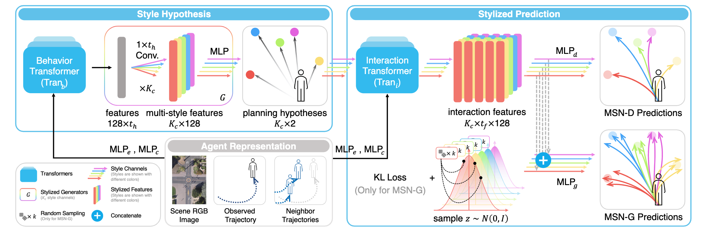

<!--
 * @Author: Conghao Wong
 * @Date: 2021-04-24 00:39:31
 * @LastEditors: Conghao Wong
 * @LastEditTime: 2021-11-17 11:04:07
 * @Description: file content
 * @Github: https://github.com/conghaowoooong
 * Copyright 2021 Conghao Wong, All Rights Reserved.
-->

# Codes for Multi-Style Network for Trajectory Prediction


---

## Abstract

Trajectory prediction aims at forecasting agents' possible future locations considering their observations along with the video context.
It is strongly required by a lot of autonomous platforms like tracking, detection, robot navigation, self-driving cars, and many other computer vision applications.
Whether it is agents' internal personality factors, interactive behaviors with the neighborhood, or the influence of surroundings, all of them might represent impacts on agents' future plannings.
However, many previous methods model and predict agents' behaviors with the same strategy or the ``single'' feature distribution, making them challenging to give predictions with sufficient style differences.
This manuscript proposes the Multi-Style Network (MSN), which utilizes style hypothesis and stylized prediction two sub-networks, to give agents multi-style predictions in a novel categorical way adaptively.
We use agents' end-point plannings and their interaction context as the basis for the behavior classification, so as to adaptively learn multiple diverse behavior styles through a series of style channels in the network.
Then, we assume one by one that the target agents will plan their future behaviors according to each of these categorized styles, thus utilizing different style channels to give a series of predictions with significant style differences in parallel.
Experiments show that the proposed MSN outperforms current state-of-the-art methods up to 10\% - 20\% quantitatively on two widely used datasets, and presents better multi-style characteristics qualitatively.



## Requirements

The packages and versions used in our experiments include:

- tqdm==4.60.0
- biplist==1.0.3
- pytest==6.2.5
- numpy==1.19.3
- matplotlib==3.4.1
- tensorflow==2.5.0
- opencv_python

We recommend you to install the above versions of the python packages in a virtual environment (like the `conda` environment), otherwise there *COULD* be other problems due to version conflicts.

Please run the following command to install the required packages:

```bash
pip install -r requirements.txt
```

## Training On Your Datasets

The `MSN` contains two main sub-networks, the style hypothesis sub-network and the stylized prediction sub-network. `MSN` predicts agents' multi-style future predictions end-to-end. For easier training, we divide it into `MSNAlpha` and `MSNBeta`, and apply gradient descent separately according to their loss functions. Please train each one together to evaluate the performance of `MSN'. But don't worry, you can use it as a normal end-to-end model after training.

### Dataset

Before training `MSN` on your own dataset, you can add your dataset information to the `datasets` directory.

- Dataset Splits File:

  It contains the dataset splits used for training and evaluation.
  For example, you can save the following python `dict` object as the `MyDataset.plist` (Maybe a python package like `biplist` is needed):

  ```python
  my_dataset = {
    'test': ['test_subset1'],
    'train': ['train_subset1', 'train_subset2', 'train_subset3'],
    'val': ['val_subset1', 'val_subset2'],
  }
  ```

- Sub-Dataset File:

  You should edit and put information about all sub-dataset, which you have written into the dataset splits file, into the `/datasets/subsets` directory.
  For example, you can save the following python `dict` object as the `test_subset1.plist`:

  ```python
  test_subset1 = {
    'dataset': 'test_subset1',    # name of that sub-dataset
    'dataset_dir': '....',        # root dir for your dataset csv file
    'order': [1, 0],              # x-y order in your csv file
    'paras': [1, 30],             # [your data fps, your video fps]
    'scale': 1,                   # scale when save visualization figs
    'video_path': '....',         # path for the corresponding video file 
  }
  ```

  Besides, all trajectories should be saved as the following `true_pos_.csv` format:

  - Size of the matrix is 4 x numTrajectoryPoints
  - The first row contains all the frame numbers
  - The second row contains all the pedestrian IDs
  - The third row contains all the y-coordinates
  - The fourth row contains all the x-coordinates

### `MSNAlpha`

`MSNAlpha` contains layers in the `style hypothesis` stage.
To train the `MSNAlpha` model, you can pass the `--model msna` argument to run the `main.py`. You should also specify the number of `hidden behavior category` by the argument `--K_train` before training the `MSNAlpha`. See section `Args Used` to learn how other args work when training and evaluating. Note that do not pass any value to `--load` when training, or it will start *evaluating* the loaded model.

For example, you can train the `MSNAlpha` via the following arguments:

```bash
cd ~/Project-Iris
python main.py --model msna --K_train 20 --model_name MyAlphaModel --test_set zara1
```

You can change the `--test_set` argument to train your model on other datasets like `eth`, `hotel`, `univ`, `zara1`, `zara2`, and `sdd`. It will save model weights at `./logs/` after training. Please see the terminal outputs or the log file `./test.log` to confirm the output messages.

You can evaluate the separate `MSNAlpha` by:

```bash
python main.py --load YOUR_MODEL_FOLDER
```

You can add the argument `--test_mode` to specify the test dataset(s) when evaluating models. See details in Section `Args Used`.
Default dataset splits are list in `plist` files in `./datasets/`. You can change them to specific your training/test/validation splits.

### `MSNBeta`

`MSNBeta` contains layers in the `stylized prediction` stage.
Similar to the above `MSNAlpha`, you can pass the `--model msnb` argument to train the `MSNBeta` model. You should also leave the `--load` argument original when training. Please see section `Args Used` to learn how other args work when training and evaluating.
You can start training by the simple command:

```bash
python main.py --model msnb --model_name MyBetaModel --test_set zara1
```

You can also evaluate the single `MSNBeta` by:

```bash
python main.py --load YOUR_OUTPUT_FOLDER
```

## Evaluation

You can use the following command to evaluate the `MSN` performance end-to-end:

```bash
python main.py --model msn --loada ALPHA_MODEL_PATH --loadb BETA_MODEL_PATH
```

The test dataset is the same as the `MSNAlpha` (which is passed by the `--loada` when training). You can change the test dataset via the `--force_set` argument. See details in `Args Used` section.
For example, you can start a simple evaluation with the command:

```bash
python main.py \
    --model msn \
    --loada ALPHA_MODEL_PATH \
    --loadb BETA_MODEL_PATH
```

## Pre-Trained Models

We have provided our pre-trained models to help you evaluate the `MSN` performance quickly. Click [here](drive.google.com) to download the zipped weights file. Please unzip it to the project's root folder. It contains model weights trained on `ETH-UCY` by the `leave-one-out` stragety, and on `SDD` via the dataset split method from SimAug.

You can use the following command to evaluate the `MSN` on `hotel` dataset in `ETH-UCY`:

```bash
python main.py --model msn \
    --loada ./pretrained_models/msn/a_K20_hotel \
    --loadb ./pretrained_models/msn/b_hotel
```

## Args Used

Please specific your customized args when training or test your model through the following way:

```bash
python main.py --ARG_KEY1 ARG_VALUE2 --ARG_KEY2 ARG_VALUE2 --ARG_KEY3 ARG_VALUE3 ...
```

where `ARG_KEY` is the name of args, and `ARG_VALUE` is the corresponding value. All args and their usages when training and test `MSN` are listed below. Args with `changable=True` means that their values can be changed after training.

<!-- DO NOT CHANGE THIS LINE -->
### Basic args

- `--batch_size`, type=`int`, changeable=`False`. Batch size when implementation.  Default value is `5000`.
- `--epochs`, type=`int`, changeable=`False`. Maximum training epochs.  Default value is `500`.
- `--force_set`, type=`str`, changeable=`True`. Force test dataset. Only works when evaluating when `test_mode` is `one`.  Default value is `'null'`.
- `--gpu`, type=`str`, changeable=`True`. Speed up training or test if you have at least one nvidia GPU. If you have no GPUs or want to run the code on your CPU, please set it to `-1`.  Default value is `'0'`.
- `--load`, type=`str`, changeable=`True`. Folder to load model. If set to `null`, it will start training new models according to other args.  Default value is `'null'`.
- `--log_dir`, type=`str`, changeable=`False`. Folder to save training logs and models. If set to `null`, logs will save at `args.save_base_dir/current_model`.  Default value is `'null'`.
- `--model_name`, type=`str`, changeable=`False`. Customized model name.  Default value is `'model'`.
- `--model`, type=`str`, changeable=`False`. Model type used to train or test.  Default value is `'none'`.
- `--restore`, type=`str`, changeable=`True`. Path to restore the pre-trained weights before training. It will not restore any weights if `args.restore == 'null'`  Default value is `'null'`.
- `--save_base_dir`, type=`str`, changeable=`False`. Base folder to save all running logs.  Default value is `'./logs'`.
- `--save_best`, type=`int`, changeable=`False`. Controls if save model with the best validation results when training.  Default value is `1`.
- `--save_format`, type=`str`, changeable=`False`. Model save format, canbe `tf` or `h5`. *This arg is now useless.*  Default value is `'tf'`.
- `--save_model`, type=`int`, changeable=`False`. Controls if save the final model at the end of training.  Default value is `1`.
- `--start_test_percent`, type=`float`, changeable=`False`. Set when to start validation during training. Range of this arg is `0 <= x <= 1`. Validation will start at `epoch = args.epochs * args.start_test_percent`.  Default value is `0.0`.
- `--test_set`, type=`str`, changeable=`False`. Dataset used when training or evaluating.  Default value is `'zara1'`.
- `--test_step`, type=`int`, changeable=`False`. Epoch interval to run validation during training.  Default value is `3`.

### Prediction args

- `--K_train`, type=`int`, changeable=`False`. Number of multiple generations when training. This arg only works for `Generative Models`.  Default value is `10`.
- `--K`, type=`int`, changeable=`True`. Number of multiple generations when test. This arg only works for `Generative Models`.  Default value is `20`.
- `--avoid_size`, type=`int`, changeable=`False`. Avoid size in grid cells when modeling social interaction.  Default value is `15`.
- `--draw_distribution`, type=`int`, changeable=`True`. Conrtols if draw distributions of predictions instead of points.  Default value is `0`.
- `--draw_results`, type=`int`, changeable=`True`. Controls if draw visualized results on video frames. Make sure that you have put video files into `./videos` according to the specific name way.  Default value is `0`.
- `--init_position`, type=`int`, changeable=`False`. ***DO NOT CHANGE THIS***.  Default value is `10000`.
- `--interest_size`, type=`int`, changeable=`False`. Interest size in grid cells when modeling social interaction.  Default value is `20`.
- `--lr`, type=`float`, changeable=`False`. Learning rate.  Default value is `0.001`.
- `--map_half_size`, type=`int`, changeable=`False`. Local map's half size.  Default value is `50`.
- `--max_batch_size`, type=`int`, changeable=`True`. Maximun batch size.  Default value is `20000`.
- `--obs_frames`, type=`int`, changeable=`False`. Observation frames for prediction.  Default value is `8`.
- `--pred_frames`, type=`int`, changeable=`False`. Prediction frames.  Default value is `12`.
- `--sigma`, type=`float`, changeable=`True`. Sigma of noise. This arg only works for `Generative Models`.  Default value is `1.0`.
- `--step`, type=`int`, changeable=`True`. Frame interval for sampling training data.  Default value is `1`.
- `--test_mode`, type=`str`, changeable=`True`. Test settings, canbe `'one'` or `'all'` or `'mix'`. When set it to `one`, it will test the model on the `args.force_set` only; When set it to `all`, it will test on each of the test dataset in `args.test_set`; When set it to `mix`, it will test on all test dataset in `args.test_set` together.  Default value is `'mix'`.
- `--use_extra_maps`, type=`int`, changeable=`True`. Controls if uses the calculated trajectory maps or the given trajectory maps. The model will load maps from `./dataset_npz/.../agent1_maps/trajMap.png` if set it to `0`, and load from `./dataset_npz/.../agent1_maps/trajMap_load.png` if set this item to `1`.  Default value is `0`.
- `--use_maps`, type=`int`, changeable=`False`. Controls if uses the trajectory maps or the social maps in the model.  Default value is `1`.
- `--window_size_expand_meter`, type=`float`, changeable=`False`. ***DO NOT CHANGE THIS***.  Default value is `10.0`.
- `--window_size_guidance_map`, type=`int`, changeable=`False`. Resolution of map (grids per meter).  Default value is `10`.

### MSN args

- `--K_train`, type=`int`, changeable=`False`. The number of hidden behavior categories in `AlphaModel`, or the number of multiple generations when training in `BetaModel`.  Default value is `10`.
- `--check`, type=`int`, changeable=`True`. Controls whether apply the results choosing strategy  Default value is `0`.
- `--loada`, type=`str`, changeable=`True`. Path for the first stage style hypothesis networks.  Default value is `'null'`.
- `--loadb`, type=`str`, changeable=`True`. Path for the second stage stylized prediction networks.  Default value is `'null'`.
- `--loadc`, type=`str`, changeable=`True`. Path for the third stage model (Preserved).  Default value is `'null'`.
<!-- DO NOT CHANGE THIS LINE -->

## Thanks

Part of codes of Transformer layers (`tf.keras.layers.Layer`) or models (`tf.keras.Model`) come from [理解语言的 Transformer 模型](https://tensorflow.google.cn/tutorials/text/transformer).

If you find this work useful, welcome to cite us with the following format:

> @article{wong2021msn,  
> &nbsp;&nbsp;&nbsp;&nbsp;author = {Wong, Conghao and Xia, Beihao and Peng, Qinmu and You, Xinge},  
> &nbsp;&nbsp;&nbsp;&nbsp;journal = {arXiv preprint arXiv:2107.00932},  
> &nbsp;&nbsp;&nbsp;&nbsp;title = {MSN: Multi-Style Network for Trajectory Prediction},  
> &nbsp;&nbsp;&nbsp;&nbsp;year = {2021},  
> }

Code Version: 2bb8eeca3488e19a13f3037bb0f43b773ddf1ac3  
Contact me with conghao_wong@iCloud.com
